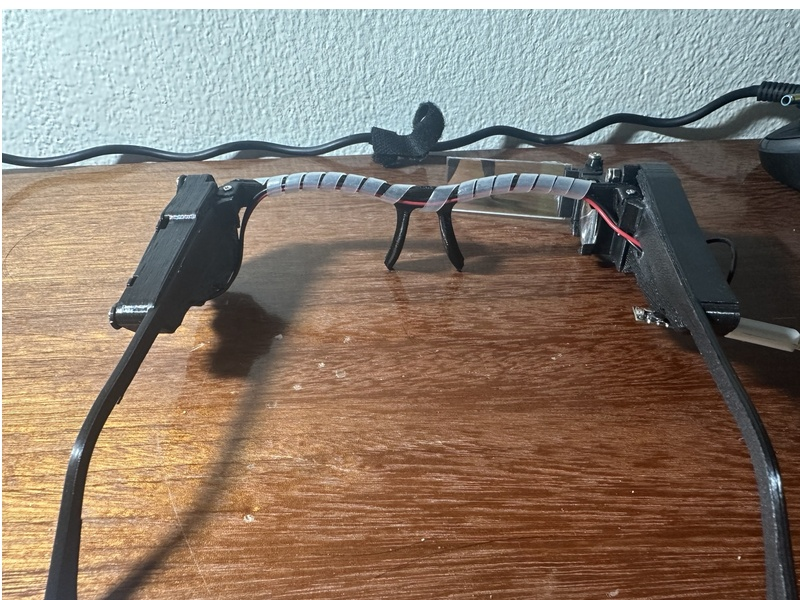
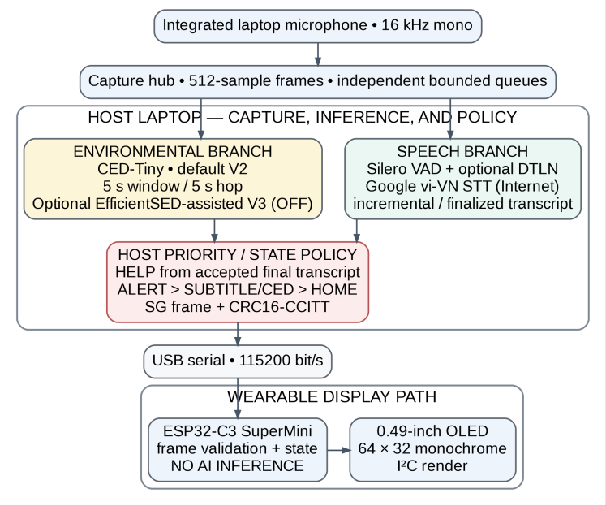
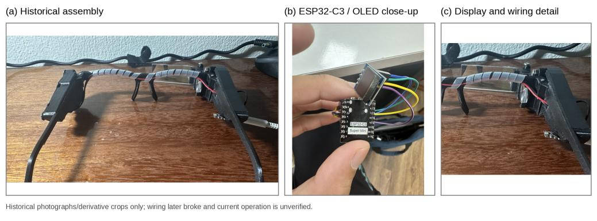
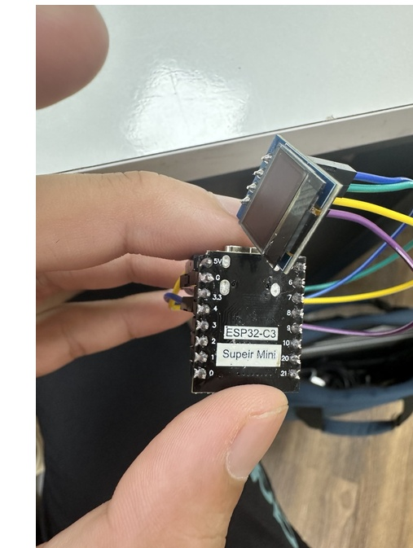
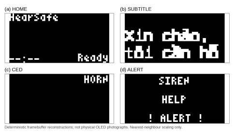
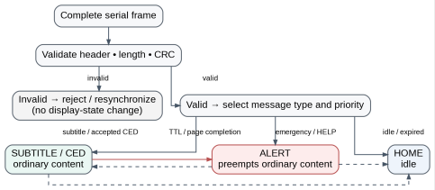
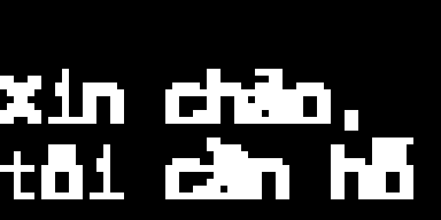
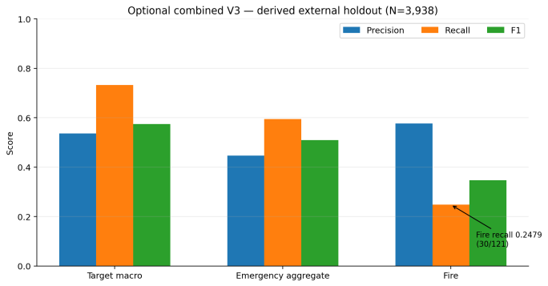
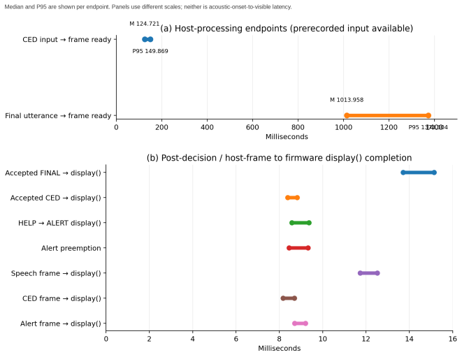
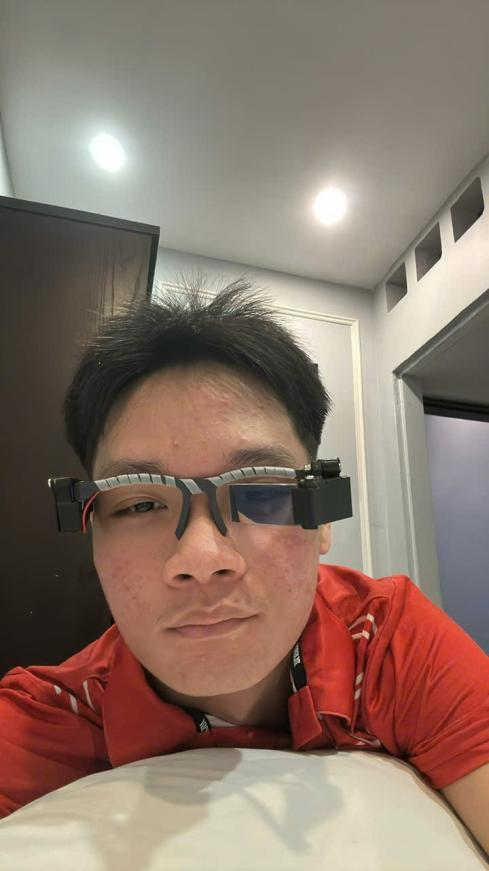

# HearVis

HearVis is a research prototype that turns Vietnamese speech and selected environmental sounds into a compact visual heads-up display. The evaluated ISIF 2026 configuration is laptop-assisted: the host performs capture, recognition, audio tagging, and priority policy; an ESP32-C3 controller validates serial frames and renders a 64 x 32 OLED.



*Historical HearSafe prototype assembly. The photograph documents the physical build but does not establish current operation.*

## Why We Built HearVis

Speech captions alone do not describe everything happening around a listener. HearVis explores whether a small visual interface can combine Vietnamese captions, selected environmental labels, and clearly preemptive alerts without pretending that a prototype is a certified safety or medical device.

The project emphasizes explicit system boundaries and reproducible, configuration-specific measurements. It does not publish a single generic "HearVis accuracy" score.

## Quick Start

```powershell
git clone https://github.com/quanle0709/SoundGuard_CED.git
cd SoundGuard_CED
python -m venv .venv
.\.venv\Scripts\Activate.ps1
python -m pip install -r requirements.txt
python app.py --help
```

The root `app.py` is the stable launcher; production host code lives under `soundguard/`. Model-backed and live modes may additionally require downloaded model assets, Internet access, microphone permission, or connected HUD hardware. See [Installation](#installation) before enabling them.

## Feature Status

| Capability | Status | What that means |
| --- | --- | --- |
| Vietnamese live captions | **Current / default speech path** | One microphone stream, Silero VAD, utterance segmentation, Google `vi-VN` STT, and partial/final HUD updates. Internet is required. |
| CED-Tiny environmental awareness | **Current / default** | Host-side window-level audio tagging, top-candidate filtering, and compact environmental labels. |
| Emergency and priority policy | **Current / default** | Deterministic host rules apply category thresholds, severity, context, temporal confirmation, cooldowns, and display priority. |
| Transcript-derived HELP | **Current / default** | Accepted final transcript text is checked independently of environmental classification and can activate ALERT. |
| ESP32-C3/OLED HUD | **Current / evaluated hardware path** | With `--hud-port`, the controller validates frames and renders HOME, SUBTITLE/CED, and ALERT states. |
| DTLN speech enhancement | **Optional / configurable** | The CLI uses it unless `--no-dtln` is supplied, but authorized local weights are required and are not distributed here. |
| Rule-based personalization | **Implemented / optional / default-off** | `--personalized-alerts` injects a validated profile into post-recognition priority selection. |
| EfficientSED combined V3 | **Optional / default-off / evaluated separately** | Isolated host-side specialist enabled explicitly; default V2 continues if it is unavailable. |
| Semantic CED mapping | **Experimental / default-off** | Compatibility environment flag used only in named evaluation configurations. |
| Sound localization or haptic output | **Future / not implemented** | No direction estimate or vibration path exists in the frozen system. |
| Standalone on-glasses AI or offline Vietnamese STT | **Future / not implemented** | The evaluated prototype requires a laptop; Google STT is an online service. |
| Familiar-voice learning or personalized acoustic models | **Not implemented** | Profiles do not learn voices, retrain CED, or fine-tune recognition models. |

## Current ISIF 2026 Prototype

The frozen evaluation boundary is **HearSafe, default V2**:

- integrated laptop microphone array for audio input;
- CED-Tiny for environmental audio tagging;
- Silero VAD and optional DTLN on the speech branch;
- Google Speech Recognition configured for Vietnamese (`vi-VN`);
- host-side HELP, emergency, and display-priority policy, with optional rule-based personalization;
- USB serial framing with CRC-16-CCITT;
- ESP32-C3 SuperMini development board and a 0.49-inch, 64 x 32, SSD1306-compatible I2C OLED.

EfficientSED is an optional combined V3 specialist. It is disabled by default, runs on the host, and was evaluated separately. No AI inference runs on the ESP32-C3 in the evaluated system.

## System Architecture



*Detailed ISIF architecture: the laptop host performs audio processing, AI inference, and policy; the ESP32-C3 validates frames and renders the OLED.*

The compute boundary is:

```text
MICROPHONE
  -> LAPTOP: one capture stream and two bounded queues
     -> local environmental branch: CED-Tiny ------------------+
     -> local speech segmentation: Silero VAD -> optional DTLN |
        -> online service: Google vi-VN STT --------------------+
  -> LAPTOP: HELP / emergency / priority policy
  -> CRC-framed USB serial
  -> ESP32-C3: validate frame and render
  -> 64 x 32 OLED
```

In the evaluated audio path, Google recognition is the only cloud step shown here. All policy runs on the host laptop; the ESP32-C3 performs no AI inference. See [docs/ARCHITECTURE.md](docs/ARCHITECTURE.md) for module and protocol details.

## Prototype



*Historical assembly, controller/OLED close-up, and wiring detail. These photographs document construction and do not prove current operation.*

The recorded mass measurements were 40.0 g, 41.5 g, and 40.5 g (N=3; mean approximately 40.7 g). Boot-to-HOME measurements from USB power were 10.0, 10.5, 10.2, 9.8, and 10.0 seconds (N=5; mean 10.1 seconds). Boot timing ends at the first HOME display; it is not application or recognition startup latency.

## Hardware



*ESP32-C3 SuperMini and 0.49-inch OLED close-up from the historical prototype.*

| Item | Evaluated/configured fact |
| --- | --- |
| Controller | ESP32-C3 SuperMini development board; PlatformIO target `esp32-c3-devkitm-1` does not establish an exact board SKU |
| Display | 0.49-inch, 64 x 32 monochrome, SSD1306-compatible OLED |
| Display bus | I2C address `0x3C`, SDA GPIO4, SCL GPIO5 in the ESP32-C3 build configuration |
| Host link | USB serial at 115200 bit/s with length and CRC validation |
| Audio input | Integrated host-laptop microphone array, not an eyewear-mounted microphone |
| Battery record | Reported protected 3.7 V Li-Po, approximately 800-1000 mAh; capacity and runtime were not independently verified |

The frozen evidence contains no implemented sound localization or haptic output.

## Software Pipeline

### Live Vietnamese captions

`soundguard/audio/streaming_audio.py` opens one 16 kHz mono microphone stream and copies each 512-sample frame into independent bounded speech and environmental queues. On the speech branch, Silero VAD drives an utterance state machine with configurable pre-roll, end silence, post-roll, partial interval, and maximum duration. The default live values are 250 ms pre-roll, 700 ms end silence, 500 ms post-roll, and partial recognition every 1.5 seconds.

Partial and final utterance snapshots are recognized through Google Speech Recognition with language `vi-VN`; accepted results become PARTIAL or FINAL subtitle frames. Google STT requires Internet and sends speech audio to an external service. DTLN is an optional speech-only preprocessing stage: it does not replace the raw audio used by CED.

### Environmental awareness

CED-Tiny analyzes host-side audio windows and returns its five highest-scoring candidates. The ordinary HUD-awareness policy scans those candidates, suppresses speech-like and alert-only labels, applies an independent 0.52 presentation threshold, and selects the strongest accepted compact label such as DOG, HORN, DOOR, BABY, or ANIMAL. A displayed label is retained briefly (5.5-second TTL) and refreshed by accepted evidence.

This Screen 2 presentation filter is separate from emergency decisions. CED provides window-level audio tags; the implementation does not estimate event onset, offset, or direction.

### Emergency, HELP, and priority rules

`soundguard/emergency/emergency_system.py` maps recognized categories to explicit thresholds, base severity, stable tie-breaking priority, and cooldowns:

| Category | Neutral threshold | Base severity | Emission cooldown |
| --- | ---: | --- | ---: |
| Gunshot / explosion | 0.45 | CRITICAL | 120 s |
| Fire | 0.50 | HIGH | 90 s |
| Smoke alarm | 0.50 | HIGH | 60 s |
| Glass breaking | 0.55 | HIGH | 60 s |
| Screaming / siren | 0.55 | HIGH | 45 s |
| Vehicle horn | 0.60 | MEDIUM | 20 s |
| Baby crying | 0.60 | MEDIUM | 30 s |
| Door activity | 0.65 | LOW | 15 s |
| Dog barking | 0.65 | LOW | 20 s |
| Speech | 0.70 | LOW | 10 s |

Indoor/outdoor context can adjust configured thresholds by 0.05 and configured severity by one level. In continuous microphone modes, an actionable sound must appear in at least two of the last three CED decisions; one-shot file/microphone mode evaluates its single window directly. Category cooldowns suppress repeated alert emissions without changing the underlying event lifecycle.

HELP follows a separate path. Only a non-empty accepted FINAL transcript is checked for bounded Vietnamese help/fire phrases. A match activates a CRITICAL HELP state, uses a 20-second emission cooldown, and can remain active through one subsequent non-matching final before ending on the second. These are deterministic research-prototype rules, not certified emergency detection.

### Optional rule-based personalization

Personalization is **implemented but default-off**. Its versioned JSON schema stores roles, contexts, responsibilities, supported-label priorities from 1 to 5, and short reasons. `ProfileManager` loads a requested user profile, falls back to `default_profile.json`, and finally to a built-in safe profile; strict validation rejects unknown fields, unsupported labels, invalid priorities, and conflicting aliases. The validator also preserves universal minimum priority for the defined critical categories.

The local interview interface can generate and review a profile using configured provider support or a deterministic role/keyword fallback. `PriorityAdapter` then reloads the validated profile when it changes and maps its priorities to LOW/MEDIUM/HIGH/CRITICAL **after recognition**. It does not change CED thresholds, train a model, learn a voice, recognize familiar people, or fine-tune STT.

### Optional EfficientSED V3 and display transport

The default/deployed V2 path uses CED-Tiny and leaves EfficientSED off. Optional combined V3 starts an isolated host-side EfficientSED worker lazily, supplies only its approved specialist categories to the existing emergency policy, preserves normal CED presentation, and falls back to V2 after missing dependencies or worker failure. Its results are reported separately from V2.

`soundguard/display/display_transport.py` NFC-normalizes text and sends length-delimited, CRC-16-CCITT frames over USB serial. Firmware accepts only complete valid frames, stores subtitle/environment/alert state, and renders the OLED. ALERT preempts SUBTITLE/CED; when it clears, an interrupted final-subtitle page resumes with a fresh reading interval. HOME appears when no subtitle, environmental label, or alert is active.

## Example Interaction

| Input | Conceptual path | Display outcome |
| --- | --- | --- |
| Spoken Vietnamese | VAD -> utterance -> Google `vi-VN` STT | PARTIAL/FINAL -> SUBTITLE |
| Vehicle horn candidate | CED-Tiny -> HUD-awareness filter | HORN in the environmental area |
| Confirmed high-priority sound | category threshold -> severity/voting/cooldown policy | ALERT |
| Accepted final help phrase | FINAL transcript -> HELP phrase rule | HELP through ALERT |

These examples describe control flow only; they do not add a performance or safety claim.

## Display and Priority Logic



*Deterministic framebuffer reconstructions, not photographs of the physical OLED.*



*Verified display-state lifecycle and alert preemption logic. No timing or safety guarantee is implied.*

ALERT has visual priority over SUBTITLE and CED; HOME is the idle state. A HELP event is visually dominant and originates from accepted final transcript content. The policy retains recent subtitle and environmental state so normal presentation can resume after an alert.

| HOME | SUBTITLE | CED | ALERT |
| --- | --- | --- | --- |
|  |  |  |  |

*Software framebuffer reconstructions: the HearSafe HOME image is a name-only publication reconstruction and was not flashed or physically retested; the other images demonstrate deterministic rendering, not recognition or emergency reliability.*

## Evaluation Strategy

Evidence is separated by layer and endpoint:

- software unit and contract tests check recognition handling, policy, transport, personalization, and HUD behavior;
- offline benchmarks report a named model/configuration and a fixed dataset denominator;
- host timing begins only after prerecorded input or a finalized utterance is available;
- firmware/display-call timing begins after the host decision or frame is available;
- physical checks document the controller/display path, boot-to-HOME, prototype mass, and bounded transport behavior;
- Layer 3 remains a planned/preliminary human-facing protocol for public reporting because the participant-level records, denominators, eligibility/consent provenance, and calculations are not locally auditable.

Details and artifact pointers are in [docs/EVALUATION.md](docs/EVALUATION.md).

## Measured Results

### Optional combined V3 external holdout



*Optional/default-off combined V3 results on a derived external holdout. These are not default V2 or wearable performance.*

| Dataset/configuration | N | Target positive | Hard negative | Macro P / R / F1 | Emergency recall | Hard-negative clip FPR |
| --- | ---: | ---: | ---: | ---: | ---: | ---: |
| Derived external holdout, optional combined V3 | 3,938 | 281 | 3,657 | 0.5368 / 0.7322 / 0.5749 | 0.5943 | 0.0566 |

Fire was the weakest reported class: 30/121 recall (0.2479). This result is a limitation, not evidence of deployment readiness. EfficientSED remains off by default.

### Timing and bounded operation



*Host and post-decision/display-call measurements use different endpoints. Neither is acoustic-onset-to-visible latency.*

| Measurement | N | Median | P95 | Boundary |
| --- | ---: | ---: | ---: | --- |
| Host CED preparation | 30 | 124.721 ms | 149.869 ms | Prerecorded input available to transport-ready frame |
| Final STT preparation | 20 | 1013.958 ms | 1373.304 ms | Finalized utterance available to transport-ready frame; network-dependent |
| Physical FINAL display-call completion | - | - | 15.139 ms | Accepted FINAL to firmware `display()` completion |
| Physical CED display-call completion | - | - | 8.824 ms | Accepted CED to firmware `display()` completion |
| Physical HELP display-call completion | - | - | 9.366 ms | HELP decision to ALERT `display()` completion |
| Physical alert preemption | - | - | 9.326 ms | Accepted alert preemption endpoint |

A finite soak campaign ran for 3,600.125 seconds with 16,449 transitions and zero failures in the tracked categories. This does not establish universal reliability or field performance.

## What We Physically Validated

- the historical laptop-assisted host-to-ESP32-C3-to-OLED path;
- CRC-protected frame receipt, state updates, and 64 x 32 rendering;
- HOME, subtitle, CED-label, ALERT, and HELP presentation behavior;
- post-decision/display-call timing for the named endpoints;
- five USB-power-to-first-HOME trials;
- three prototype mass measurements and worn placement documentation.

Physical checks do **not** establish acoustic-onset-to-visible latency, field detection accuracy, battery endurance, long-term comfort, optical readability for DHH users, standalone operation, or certified safety performance.

## Current Limitations

- The evaluated system needs a laptop; it is not standalone eyewear.
- Google STT requires Internet and transfers speech audio to an external provider.
- CED-Tiny produces window-level tags rather than verified event boundaries or localization.
- Optional V3 has weak fire recall on the reported external holdout and is disabled by default.
- Priority alerts are deterministic prototype behavior, not certified emergency detection.
- Battery capacity/runtime and exact component SKUs are not independently verified.
- No haptic output or sound-direction feature exists in the frozen evidence.
- No verified DHH-user effectiveness result is published under the current Layer 3 provenance state.
- The repository has no project-wide open-source license; third-party components retain their own licenses.

See [docs/PRIVACY_AND_LIMITATIONS.md](docs/PRIVACY_AND_LIMITATIONS.md) before recording audio or conducting a study.

## Repository Structure

| Path | Purpose |
| --- | --- |
| `app.py` | Stable root launcher for the host CLI |
| `soundguard/` | Production host runtime, grouped by audio, speech, detection, emergency, and display |
| `tests/` | Runtime, policy, personalization, transport, and firmware source-contract tests |
| `firmware/` | PlatformIO ESP32/ESP32-C3 OLED firmware |
| `personalization/` | Opt-in post-recognition rule/profile adapter |
| `benchmark/`, `benchmark_v1/` | Current evaluation code and the retained fixed-file workflow |
| `benchmark_data/`, `benchmark_results/` | Reproducibility inputs and historical evidence |
| `human_study/` | Protocol and local study tooling; private/raw results excluded |
| `tools/` | Hardware-validation and transport-diagnostic utilities |
| `docs/` | Architecture, evaluation, research records, attribution, privacy boundaries, and public images |

See [docs/REPOSITORY_LAYOUT.md](docs/REPOSITORY_LAYOUT.md) for the complete ownership map and the distinction between current code and historical evidence.

## Installation

Windows PowerShell is the documented host environment. Python package and model compatibility can vary; use an isolated environment.

```powershell
git clone https://github.com/quanle0709/SoundGuard_CED.git
cd SoundGuard_CED
python -m venv .venv
.\.venv\Scripts\Activate.ps1
python -m pip install --upgrade pip
python -m pip install -r requirements.txt
```

CED-Tiny and Silero VAD may download on first use. DTLN weights are intentionally not distributed in this repository; place authorized upstream `model_1.tflite` and `model_2.tflite` files under `external/DTLN-master/pretrained_model/` before enabling DTLN. Do not commit model weights.

For the wearable firmware, install PlatformIO and build the evaluated ESP32-C3 configuration:

```powershell
pio run -d firmware -e esp32c3
```

Confirm the actual wiring and serial port before upload. The `esp32c3` build target is a toolchain target, not proof of the exact physical board SKU.

## Running HearVis / HearSafe

List audio devices and inspect all options:

```powershell
python app.py --list-devices
python app.py --help
```

Run a local WAV without DTLN, or use the microphone paths:

```powershell
python app.py .\path\to\audio.wav --no-dtln
python app.py --mic --duration 8 --no-dtln
python app.py --continuous --duration 5 --no-dtln
python app.py --live-stt --end-silence-ms 700 --post-roll-ms 500 --no-dtln
```

These examples use `--no-dtln` so they do not require the separately obtained weights. When both authorized DTLN model files are installed, omit that flag to use the configured speech-enhancement stage. Change the emergency context explicitly with `--context indoor`, `--context outdoor`, or the default `--context neutral`.

Send deterministic HUD test frames, then run live captions with the display:

```powershell
python app.py --hud-port COM5 --hud-test
python app.py --live-stt --hud-port COM5 --no-dtln
```

Create and apply an optional personalization profile through the local interface:

```powershell
python -m personalization.web_server
# Open http://127.0.0.1:8765, review the profile, then select Apply.
python app.py --live-stt --hud-port COM5 --no-dtln --personalized-alerts
```

Use a specific validated profile instead of the default user-profile location:

```powershell
python app.py --live-stt --no-dtln --personalized-alerts --profile-path .\path\to\profile.json
```

Without `--personalized-alerts`, profile files do not affect runtime priority.

Only enable optional V3 when its isolated dependencies and audited checkpoint are available:

```powershell
$env:SOUNDGUARD_ENABLE_SEMANTIC_CED_MAPPING = '1'
python app.py --mic --duration 5 --no-dtln --emergency-v3
```

This example explicitly enables both the named semantic-mapping evaluation setting and V3; neither is part of an ordinary default V2 run.

Environment-variable and protocol names containing `SOUNDGUARD` are preserved for compatibility and provenance.

## Testing and Benchmarks

Run the lightweight offline software checks:

```powershell
.\run_software_tests.ps1
```

Run the broader local suite without deliberately invoking microphone capture or Google STT:

```powershell
python -m pytest -q
```

Build both maintained firmware environments:

```powershell
pio run -d firmware -e esp32c3
pio run -d firmware -e esp32dev
```

Network STT, private/local audio, external dataset downloads, hardware upload, and live microphone tests require explicit operator consent and suitable hardware/data. Benchmark commands and evidence boundaries are documented in [docs/EVALUATION.md](docs/EVALUATION.md).

## Research Paper

The ISIF 2026 manuscript documents the laptop-assisted **HearSafe** configuration. The current draft is intentionally not published. After submission is frozen, link the final frozen/submitted manuscript at:

**HearVis** is the current public-facing project name. **HearSafe Glasses** (or **HearSafe**) names the prototype evaluated for the manuscript. **SoundGuard** and `SoundGuard_CED` remain in development history, provenance-sensitive paths, configuration variables, and protocol literals.

`docs/paper/HearSafe_ISIF_2026_Full_Paper.pdf`

The manuscript must not be described as peer-reviewed, published, or accepted unless that status later becomes true.

## Future Development

Future HearVis work may explore a standalone compute path, on-device or privacy-preserving speech recognition, improved fire-sound evidence, optical/ergonomic iteration, battery characterization, and auditable studies with DHH participants. These are development directions, not current capabilities.



*Team-member fit check with the historical prototype. The wearer is a project team member, not a DHH study participant; this image documents worn placement only.*

## Third-Party Components and Attribution

- CED-Tiny model ID: `mispeech/ced-tiny`; model terms apply separately.
- Silero VAD: loaded through the `silero-vad` package under its upstream terms.
- DTLN: third-party work by Nils L. Westhausen; the retained upstream license is at `external/DTLN-master/LICENSE`.
- EfficientSED: optional/default-off experimental specialist; see `docs/THIRD_PARTY_EFFICIENTSED.md` and its upstream license/terms.
- Google Speech Recognition: external, network-dependent service accessed through the Python SpeechRecognition package; provider terms and privacy requirements apply.
- Adafruit GFX, Adafruit SSD1306, and U8g2 for Adafruit GFX: firmware libraries installed by PlatformIO under their respective licenses.

No repository-wide license is currently granted for the original HearVis/HearSafe/SoundGuard code. Contact the project team before reuse.

## Contributors

HearVis / HearSafe project team. Individual development contributions and historical SoundGuard provenance are preserved in the Git history.

## Project Status

**Research prototype - active development.** The laptop-assisted HearSafe evaluation configuration is frozen for ISIF 2026 evidence reporting. This repository is not a medical device, is not certified for safety use, and is not deployment-ready.
